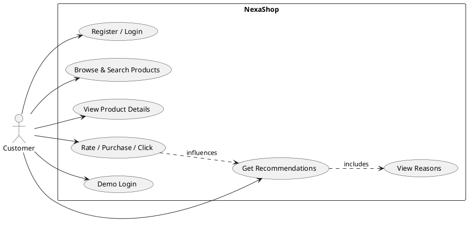
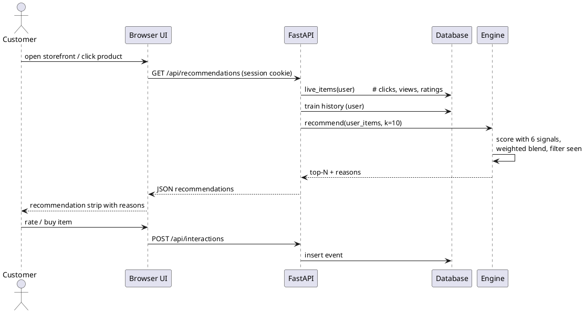
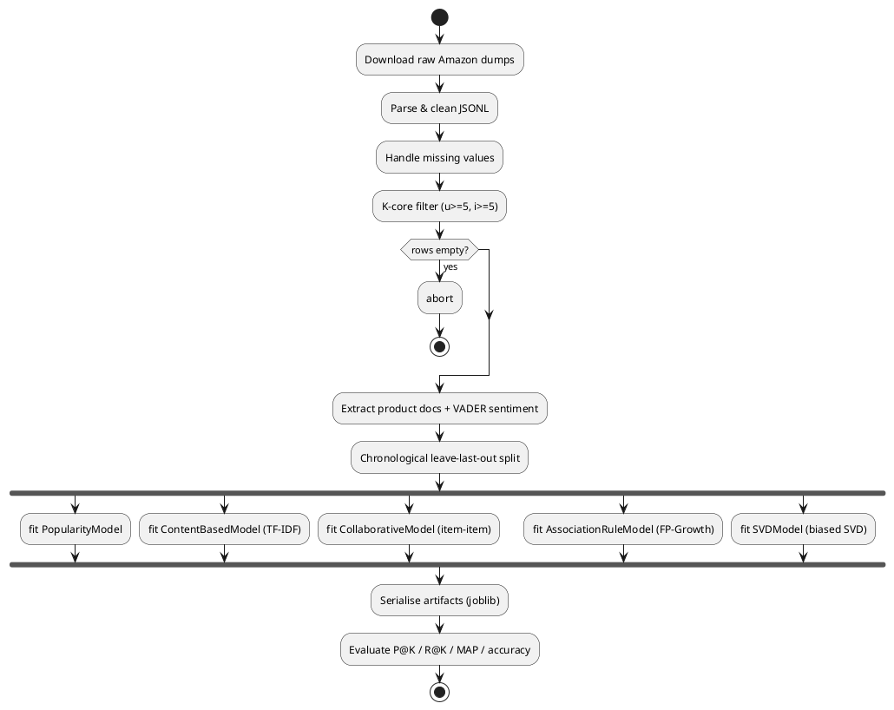

# Report Sections — NexaShop Hybrid E-Commerce Recommendation System

Sections 5 (System Design) and 6 (Implementation) for the final-year project report.
Each UML diagram below is described for manual drawing AND provided as PlantUML —
paste the code at https://www.plantuml.com/plantuml to render it, or draw in draw.io /
StarUML following the specification.

---

## 5. System Design

### 5.1 System Architecture

The system follows a layered client–server architecture organised into five
tiers, exactly matching the project architecture diagram:

1. **User / Customer Layer** – the shopper interacts through a web browser.
2. **User Interface Layer** – a responsive storefront (HTML/CSS/JS) providing
   login/signup, product search and browse, product detail view, a personalised
   recommendation strip with explanation reasons, and feedback controls
   (rating stars, buy button).
3. **Application / Backend Layer** – a FastAPI application implementing four
   subsystems: *User Management* (signup, login, session cookies), *Product
   Management* (catalog, search, category facets), *Interaction Tracking*
   (view/click/rate/purchase events persisted per user), and *Recommendation
   Service* (scores candidate items and returns top-N with reasons).
4. **Data Storage Layer** – (a) processed CSV stores for the product catalog,
   interaction logs and user–item splits; (b) an SQLite database for live
   users, sessions and real-time events; (c) serialised model artifacts
   (joblib) holding the fitted recommenders.
5. **Offline Analytics Layer** – the data preprocessing pipeline and the
   hybrid recommendation engine (details in 5.3).

### 5.2 Data Preprocessing Pipeline

Raw Amazon review and metadata dumps pass through:

- **Data cleaning** – parse JSONL, drop malformed rows, normalise schema
  differences between the 2014 review format and metadata format.
- **Missing-value handling** – empty title/brand/category replaced with
  placeholders; missing price/image tolerated; reviews lacking a usable item
  key are discarded.
- **Filtering** – k-core (k = 5) filtering keeps only users and items with at
  least five interactions, ensuring sufficient density for collaborative
  methods.
- **Feature extraction** – product text document = title + brand + categories
  + description; VADER sentiment score computed per item from its reviews.
- **Transformation** – implicit ratings normalised to 1–5; user–item rating
  matrix built as sparse CSR; timestamps used for a chronological
  leave-last-out train/test split.
- **Output** – `train.csv`, `test.csv`, `products.csv`, `product_docs.csv`.

### 5.3 Hybrid Recommendation Engine

Four scoring components produce a score in [0,1] for each candidate item:

| Component | Technique | Signal captured |
|---|---|---|
| Content-Based Filtering | TF-IDF + cosine similarity between the user's liked items and candidate text | item attributes / taste |
| Collaborative Filtering | item–item cosine similarity on the centred user–item matrix | "users like you" |
| Association Rule Mining | FP-Growth rules over purchase baskets; score = confidence × lift | "frequently bought together" |
| Matrix Factorisation | biased SVD (user/item biases + 64 latent factors) | latent preference factors |

Two prior terms are added: **popularity** (Bayesian-averaged rating) and
**sentiment** (VADER compound score). The hybrid score is a weighted sum:

    score(i) = Σ_c  w_c · s_c(i),   Σw_c = 1

weights: content 0.30, collaborative 0.30, association 0.15, SVD 0.05,
popularity 0.10, sentiment 0.10. Candidates already seen are excluded, scores
are ranked, and the top-N products are returned. For each recommended item a
**reason** is generated from its two strongest contributing signals (e.g.
"Customers with similar taste rated X", "Frequently bought with Y",
"Matches your interests in Hair Care").

The engine also supports **rating/likeability prediction**: biased-SVD
produces r̂(ui) = μ + b_u + b_i + p_u·q_i, used for the accuracy evaluation.

### 5.4 UML Diagrams

#### (a) Use Case Diagram

Actor: **Customer** (a second implicit actor, *System*, handles batch
preprocessing/training offline — draw it if your template needs a secondary
actor).

Customer use cases:
- Register / Login / Logout
- Browse products & categories
- Search products
- View product details
- Receive personalised recommendations *(includes: View recommendation reasons)*
- Provide feedback *(extend: Rate product, Purchase product, Click product)*
- Demo login (use sample user)



#### (b) Class Diagram

```plantuml
@startuml
class PopularityModel { +fit(df)  +score(user_items, item) }
class ContentBasedModel { +fit(docs)  +score(user_items, item) }
class CollaborativeModel { +fit(train)  +score(user_items, item) }
class AssociationRuleModel { +fit(train)  +score(user_items, item) }
class SVDModel { +fit(train)  +predict(user,item)  +score(user_items,item) }
class RecommenderEngine {
  -weights : dict
  +train(train, docs, prods)
  +recommend(user_items, k) : list[Rec]
  +predict_rating(user, item) : float
}
RecommenderEngine o-- PopularityModel
RecommenderEngine o-- ContentBasedModel
RecommenderEngine o-- CollaborativeModel
RecommenderEngine o-- AssociationRuleModel
RecommenderEngine o-- SVDModel
class FastAPIApp { +/api/signup /login /demo\n+/api/products  /api/interactions\n+/api/recommendations }
class Database { +users +sessions +interactions\n+live_items(user) }
FastAPIApp --> RecommenderEngine
FastAPIApp --> Database
@enduml
```

#### (c) Sequence Diagram — Personalised Recommendation Request



#### (d) Activity Diagram — Training Pipeline



#### (e) Data / ER Sketch

```
users(username PK, password_hash, created_at)
sessions(token PK, username FK, created_at)
interactions(id PK, username FK, asin FK, event, rating, ts)
train(user, asin, rating, ts)      # offline store
test(user, asin, rating, ts)
products(asin PK, title, brand, category, price, image, description, sentiment)
```

---

## 6. Implementation

### 6.1 Technology Stack

| Layer | Technology |
|---|---|
| Language | Python 3.9+ |
| Backend | FastAPI + Uvicorn, Pydantic |
| Frontend | Vanilla HTML/CSS/JavaScript (fetch API, session cookie) |
| Storage | CSV/Parquet-free CSV stores + SQLite (runtime), joblib artifacts |
| ML | scikit-learn (TF-IDF, TruncatedSVD), mlxtend (FP-Growth), VADER (sentiment), scipy sparse, pandas, numpy |
| Evaluation | custom leave-one-out harness (`scripts/evaluate.py`, `evaluate_ratings.py`) |
| Deployment | Docker, docs for EC2/Render/Railway |

### 6.2 Module Implementation

- `scripts/download_data.py`, `filter_meta.py` – dataset acquisition.
- `scripts/build_dataset.py` – cleaning → k-core → docs → sentiment → split.
- `app/recommender/models.py` – five model classes with a uniform
  `score(user_items, item)` interface.
- `app/recommender/engine.py` – `RecommenderEngine.recommend()`: candidate
  generation, per-signal scoring, weighted blend, top-N, reason generation.
- `app/main.py` – FastAPI routes: `/api/signup`, `/api/login`, `/api/demo`,
  `/api/products` (search/category/paging), `/api/products/{asin}`,
  `/api/interactions`, `/api/recommendations` (merges offline history with
  live SQLite events so recommendations update in real time).
- `app/db.py` – users, sessions, interactions tables; `live_items()`
  aggregates events into strengths (view 1, click 2, purchase 4, rating = r).
- `app/static/` – storefront UI: auth card, category chips, search, product
  grid + modal with star rating & buy, recommendation strip with reason chips.

### 6.3 Algorithms

- **TF-IDF**: tf(t,d)·log(N/df_t), L2-normalised, unigram+bigram vocabulary (40k features, min_df=3); user profile = mean vector of liked items.
- **Item–item CF**: cosine on mean-centred user–item CSR matrix, top-50 neighbours per item.
- **FP-Growth**: baskets = positive (rating ≥ 4) items per user;
  min_support 0.002, min_confidence 0.15 → 239 rules;
  rule score = confidence × lift.
- **Biased SVD**: r̂ = μ + b_u + b_i + p_u·q_i (64 factors), used both as a
  hybrid signal and for rating/likeability prediction.
- **Hybrid**: weighted sum (weights above), seen-item exclusion, top-N.

### 6.4 Dataset

Amazon Beauty 5-core (SNAP/McAuley): 198,502 reviews, 22,363 users,
12,101 items; matching 2014 metadata (title/category/brand/price/image).
After preprocessing: 198,215 interactions, 175,883 train / 22,332 test.

### 6.5 Results

Ranking (leave-one-out, 2,000 users, K=10):

| Model | P@10 | R@10 | F1@10 | MAP@10 |
|---|---|---|---|---|
| Popularity | 0.0007 | 0.0070 | 0.0013 | 0.0015 |
| Content-based | 0.0070 | 0.0705 | 0.0128 | 0.0287 |
| Collaborative | 0.0009 | 0.0090 | 0.0016 | 0.0026 |
| Association rules | 0.0008 | 0.0075 | 0.0014 | 0.0047 |
| SVD | 0.0004 | 0.0045 | 0.0008 | 0.0010 |
| **Hybrid** | 0.0067 | 0.0665 | 0.0121 | **0.0358** |

Likeability prediction (held-out ratings, n=1,000): **accuracy 78.9%**,
F1 0.878, RMSE 1.10, MAE 0.82, ROC-AUC 0.705.
